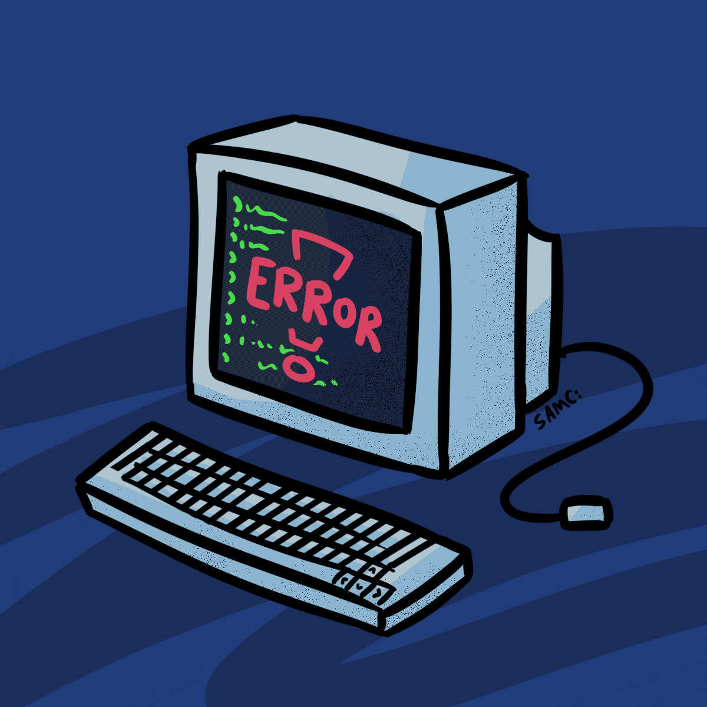

  

<h1 align="center">Mariya Nenot</h1>

<h3 align="center">
AI Systems | Embedded Systems | Electronics | Robotics
</h3>

Building intelligent systems from silicon to software.

 

<h2 align="center">👨‍💻 About Me</h2>

- Designing and building intelligent systems across hardware, embedded software, AI, and cloud technologies.
- Passionate about Embedded Systems, Artificial Intelligence, Electronics, Robotics, and Industrial Automation.
- Interested in system architecture, distributed systems, edge computing, and computer vision.
- Enjoy solving complex engineering problems through practical and scalable solutions.
- Always exploring emerging technologies and contributing to meaningful engineering projects.

 

<h2 align="center">🛠 Tech Stack</h2>

### 💻 Programming Languages

### 🎨 Frontend

### 🤖 Artificial Intelligence

### 🔌 Embedded Systems

### ☁️ Backend & Cloud

### 🗄️ Databases

### 📡 Communication Protocols

### 🛠️ Development Tools

<h2 align="center">📊 GitHub Statistics</h2>

<table align="center" border="0">
<tr>

<td width="65%" valign="top">

  

  

</td>

<td width="35%" align="center" valign="middle">

</td>

</tr>
</table>

 

  

<h2 align="center">💡 Engineering Philosophy</h2>

Building technology with a systems-first mindset—where hardware, embedded software,
artificial intelligence, and cloud platforms work together as a unified solution.

I believe great engineering is built on strong fundamentals, scalable architecture,
and solving real-world problems through thoughtful design and continuous innovation.

<h2 align="center">⚡ Core Competencies</h2>

<table align="center">
<tr>
<td align="center">

🧠 AI Systems

</td>

<td align="center">

⚙ Embedded Engineering

</td>

<td align="center">

☁ Cloud Architecture

</td>

<td align="center">

🏭 Industrial Automation

</td>

</tr>
</table>

<h2 align="center">🏆 Certifications & Achievements</h2>

🏅 NVIDIA Inception Program Member 
🚀 DPIIT Recognized Startup Contributor 
💡 MeitY EIR Supported Startup 
🏢 Incubated at AIC RAISE, Coimbatore

<h2 align="center">🏅 Coding Profiles</h2>

  

  

<h2 align="center">🌐 Connect With Me</h2>

<h2 align="center">🐍 Contribution Snake</h2>

  <picture>
    <source
      media="(prefers-color-scheme: dark)"
      srcset="https://raw.githubusercontent.com/M-Nenot/M-Nenot/output/github-contribution-grid-snake-dark.svg"
    />
    <source
      media="(prefers-color-scheme: light)"
      srcset="https://raw.githubusercontent.com/M-Nenot/M-Nenot/output/github-contribution-grid-snake.svg"
    />
    
  </picture>

